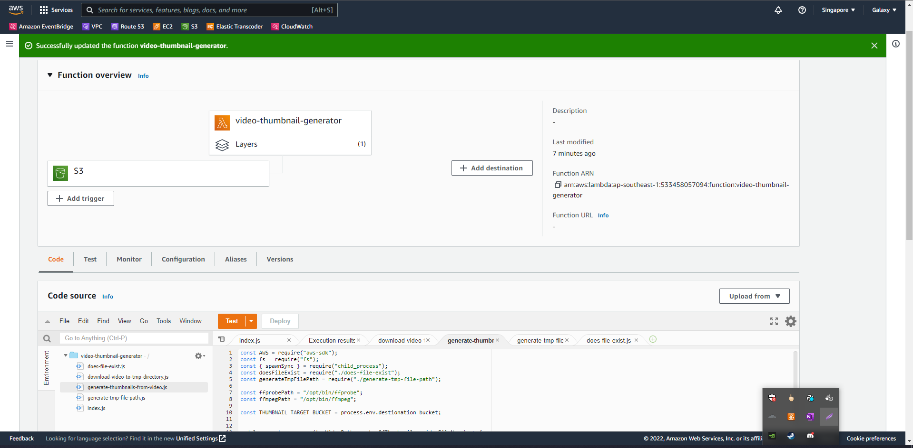

# How to generate poster image from video 

> This site was built using the reference of [Generate Thumbnail from video using lambda](https://www.norrapscm.com/posts/2021-02-08-generate-thumbnails-in-lambda-from-s3-with-ffmpeg/)

***Follow these steps***

1. Create Input Bucket
2. Create Destination Bucket
3. Create Lambda
4. Trigger Lambda with S3
5. Add Lambda role to S3 Bucket Policy
6. Add layer in configuration [ffmpeg layer](https://serverlessrepo.aws.amazon.com/applications/us-east-1/145266761615/ffmpeg-lambda-layer)
7. View logs in cloudwatch with your function name

